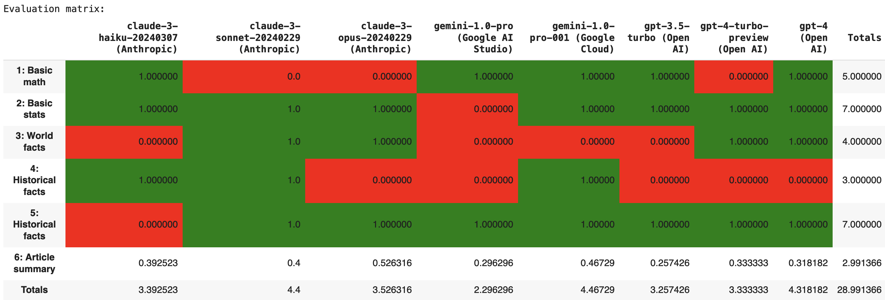
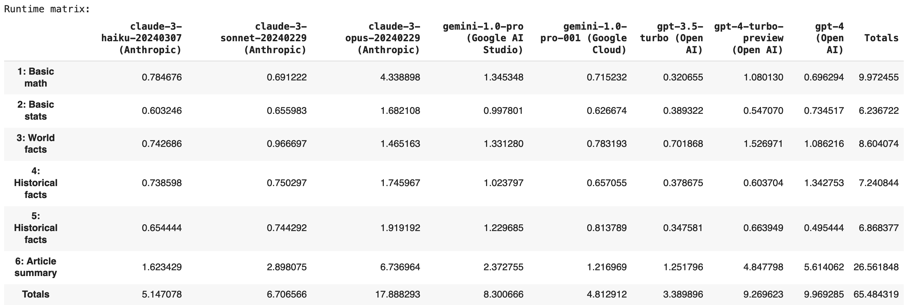

# BSD_Evals
LLM evaluation framework

This project enables the creation of your own LLM evaluation framework against popular LLM providers (Anthropic, Google, OpenAI) and cloud providers (Google Cloud) and then output to a formatted text table or HTML table. It is lightweight and easy to read and extend by design.

See [Which LLM is the Best? Let's Build a Model Evaluation Framework and Find Out.](https://brettdidonato.substack.com/p/which-llm-is-the-best-lets-build) for additional background.

# Setup

Install required packages:

```
pip install -r requirements.txt
```

Update **config.ini** before running to enable APIs and services as needed:

```
[API Keys]
ANTHROPIC_API_KEY = ADD_HERE
GOOGLE_AI_STUDIO_API_KEY = ADD_HERE
OPENAI_API_KEY = ADD_HERE

[Cloud Configs]
GCP_PROJECT = ADD_HERE
GCP_PROJECT_LOCATION = ADD_HERE
```

# Usage

Run **test.py** or walk through the notebook **BSD_Evals.ipynb** to get started:

```
python test.py
```

Once your evaluation has completed you will see an evaluation summary:

```
Total runtime: 65.56242179870605

Models: 8
Evals: 6
Total Evals: 48
Passed Evals: 26
Failed Evals: 14
Other Evals: 8
```

An evaluation matrix:


And a runtime matrix:


# Additional Configurations

See **evals/test_evals.json** for an example on how to define your own set of evaluations.

Evaluation types include:
* **perfect_exact_match**: Expected and actual results must match exactly.
* **case_insensitive_match**: Same as perfect_exact_match except upper and lowercase letters are treated as a match.
* **rouge**: Measures the similarity of text passages. This is good for summarization use cases.
* **sql_generation_results**: For prompts that generate SQL, this takes the next step and executes the generated SQL. Then the SQL result is compared to expected output and must match exactly (perfect_exact_match).

Final output can be defined as a formatted text table or HTML table:

```
evals.display_results("text")  # Formatted text table
evals.display_results("html")  # HTML table
```